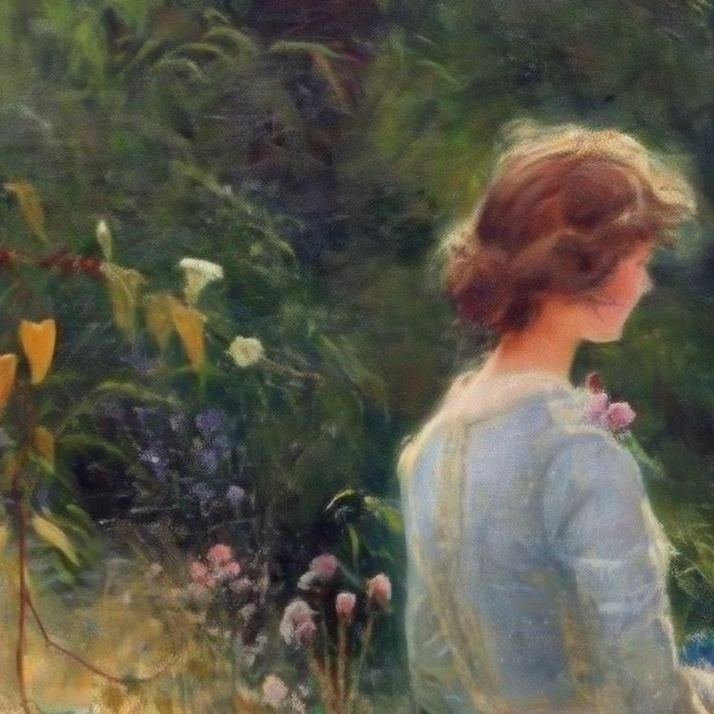

# Deep Art Outpainting

This project explored the applications of latest generative models in the subspace of artwork imagery, particularly for the task of restoring largely incomplete pieces of oil paintings belonging to realism, impressionism, and similar styles that were painted on canvas.

## Description
The simulated artwork restoration pipeline consists of the following steps:
1. An unfinished painting image is created by segmenting and retaining the subjects of the original image
2. The masked image is fed into a generative model to fill in the empty regions
3. The outpainting result is processed by an upsampling model to produce a high resolution final reconstruction

### 1. Artwork subject segmentation
To extract regions of interest from an image, a specialized segmentation method designed to work with art images proposed in [Semantic Segmentation in Art Paintings](https://arxiv.org/abs/2203.03238) is used. The pixels corresponding to non-background class in the produced segmentation mask are retained, imitating an unfinished painting.

### 2. Artwork outpainting
Two generative models were considered for the task:
1. "Artificially Inspired", a winner of [NTIRE 2022 Image Inpainting Challenge Track 1](https://openaccess.thecvf.com/content/CVPR2022W/NTIRE/html/Romero_NTIRE_2022_Image_Inpainting_Challenge_Report_CVPRW_2022_paper.html). A CoModGAN fine-tuned specifically on [WikiArt](https://www.kaggle.com/competitions/painter-by-numbers) data.
2. A generic [Stable Diffusion Inpainting](https://huggingface.co/runwayml/stable-diffusion-inpainting) model from RunwayML.

For equal comparison, the input masked images were resized to 512x512 resolution due to the input requirements of model 2.

### 3. Artwork super resolution
A custom [ESRGAN](https://arxiv.org/abs/1809.00219) 4x super resolution model was trained to perform realistic upscaling of generated paintings. 

For this purpose, a new [WikiArt SR](https://drive.google.com/drive/folders/1bNfSIpoTAE53zoN4rVsxfIgjKgHw3e7A) dataset consisting of 350 high resolution (>2K) artwork images belonging to considered style space was compiled from [WikiArt](https://www.wikiart.org) data. 

The model was fine-tuned from base [4x PSNR](https://drive.google.com/drive/folders/1ldwajXL50uC7PCS63B4Wato6Dnk-svNL) weights using pixel, feature and adversarial losses for 136 epochs. Full training configuration and runs can be found under `configs/SR/traiNNer_SR_train.yml` and `notebooks/SR_training.ipynb` respectively.

## Set-up and execution
The project was designed to be executed on Google Colab. Please refer to `notebooks/deep_art_outpainting_pipeline.ipynb` for step-by-step instructions.
## Results

### Super resolution on WikiArt SR test set

<table>
<tr>
<th>Low resolution</th>
<th>4x PSNR</th>
<th>4x Art ESRGAN</th>
<th>Original high resolution</th>
</tr>
<tr>
<td></td>
<td></td>
<td></td>
<td></td>
</tr>
</tr>
</table>

### Restoration pipeline
<table>
<tr>
<th>Original</th>
<th>Subject mask</th>
<th>Stable Diffusion + 4x Art ESRGAN </th>
<th>Artificially Inspired + 4x Art ESRGAN</th>
</tr>
<tr>
<td></td>
<td></td>
<td></td>
<td></td>
</tr>
<tr>
<td></td>
<td></td>
<td></td>
<td></td>
</tr>
<tr>
<td></td>
<td></td>
<td></td>
<td></td>
</tr>
</table>